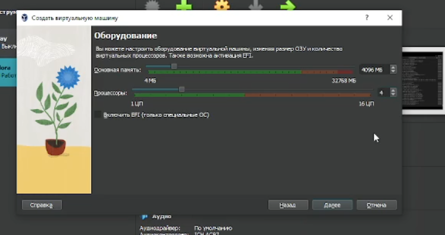

---
## Front matter
lang: ru-RU
title: Лабораторная работа №1
subtitle: Установка и конфигурация операционной системы на виртуальную машину
author:
  - Колонтырский И.Р.
institute:
  - Российский университет дружбы народов, Москва, Россия
date: 14 сентября 2024

## i18n babel
babel-lang: russian
babel-otherlangs: english

## Formatting pdf
toc: false
toc-title: Содержание
slide_level: 2
aspectratio: 169
section-titles: true
theme: metropolis
header-includes:
 - \metroset{progressbar=frametitle,sectionpage=progressbar,numbering=fraction}
 - '\makeatletter'
 - '\beamer@ignorenonframefalse'
 - '\makeatother'

##Fonts
mainfont: PT Serif
romanfont: PT Serif
sansfont: PT Sans
monofont: PT Mono
mainfontoptions: Ligatures=TeX
romanfontoptions: Ligatures=TeX
sansfontoptions: Ligatures=TeX,Scale=MatchLowercase
monofontoptions: Scale=MatchLowercase,Scale=0.9
---

## Цель

Приобретение практических навыков установки операционной системы на виртуальную машину, настройки минимально необходимых для дальнейшей работы сервисов.

# Выполнение лабораторной работы

# Установка виртуальной машины

## Настройка машины в VB

{width=100%}

## Настройка машины в VB

{width=100%}

## Настройка машины в VB

{width=100%}

## Настройка клавиатуры

{width=100%}

## Выбор пакетов

{width=100%}

## Изменение имени хоста

{width=80%}

## Рут и пользователь

{width=45%}

{width=45%}

## Гостевая ОС

{width=80%}

# Контрольные вопросы

## 1. Какую информацию содержит учётная запись пользователя?

Учетная запись пользователя содержит информацию о его имени, идентификаторе пользователя, идентификаторе группы, домашнем каталоге, оболочке по умолчанию и других параметрах.

## 2. Укажите команды терминала и приведите примеры
Kоманды терминала и примеры:

 - Для перемещения по файловой системе: cd <путь_к_каталогу> (например, cd Documents).
 
 - Для просмотра содержимого каталога: ls.
 
 - Для определения объема каталога: du -sh <путь_к_каталогу> (например, du -sh Documents).
 
 - Для создания каталогов / файлов: mkdir <название_каталога> / touch <название_файла> (например, mkdir NewFolder / touch newfile.txt).
 
 - Для удаления каталогов / файлов: rm -r <название_каталога> / rm <название_файла> (например, rm -r OldFolder / rm oldfile.txt).
  
 - Для просмотра истории команд: history.
 
## 3. Что такое файловая система? Приведите примеры с краткой характеристикой.

Файловая система - это способ организации и хранения файлов на носителях данных. Примеры файловых систем:

   - ext4: одна из самых распространенных файловых систем в Linux, обеспечивает хорошую производительность и надежность.
   
   - NTFS: файловая система, используемая в операционных системах Windows.
   
   - APFS: файловая система, разработанная Apple для macOS, обладает функциями шифрования и оптимизации хранения данных.
   
## 4. Как посмотреть, какие файловые системы подмонтированы в ОС?

Чтобы посмотреть, какие файловые системы подмонтированы в ОС, можно использовать команду df -h.

## 5. Как удалить зависший процесс?

Чтобы удалить зависший процесс, можно воспользоваться командой kill <идентификатор процесса>.

# Вывод

## Вывод

В ходе выполнения лабораторной работы я создал виртуальную машину и научился её настраивать для последующей комфортной работы.

