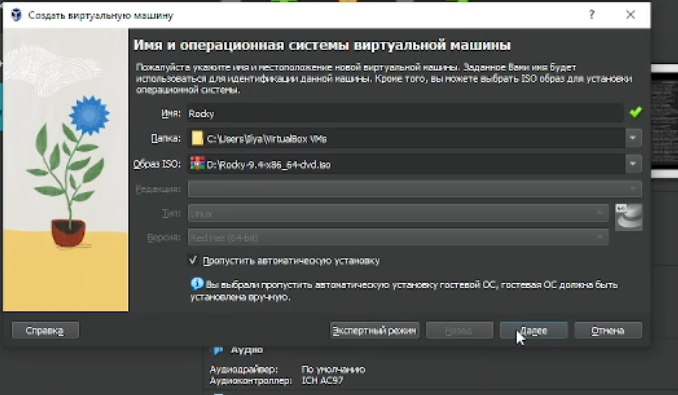
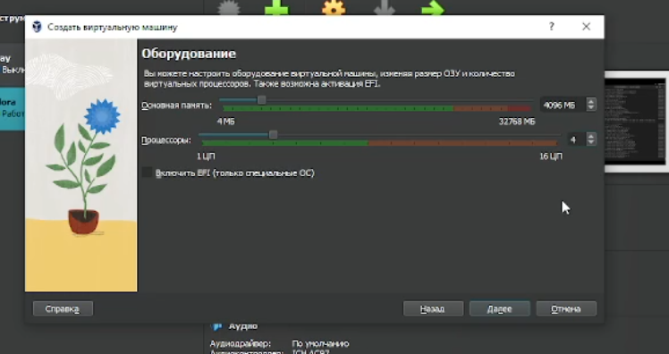
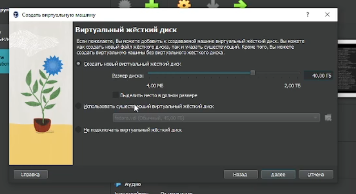
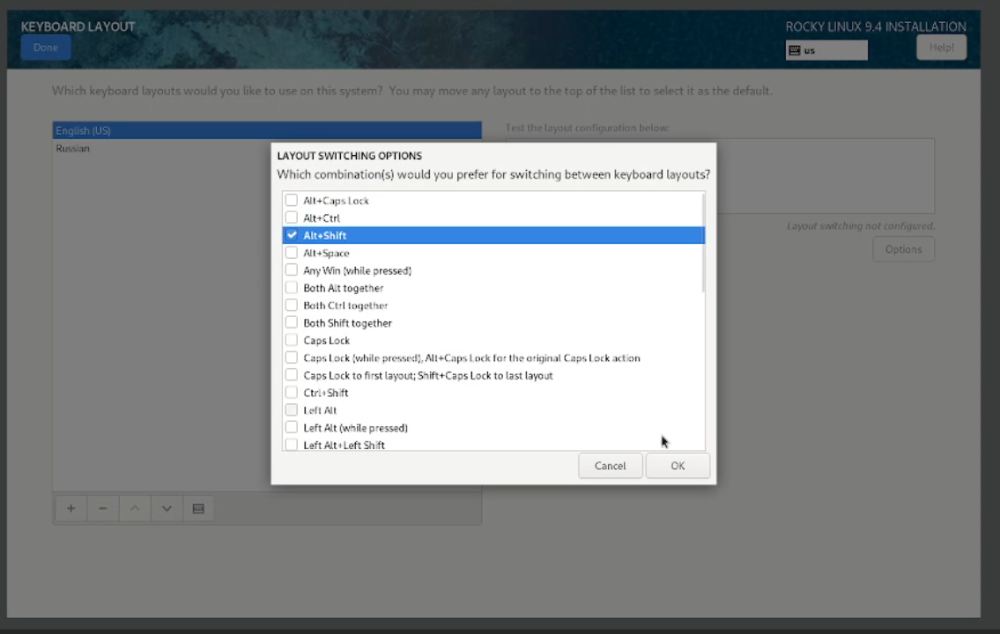
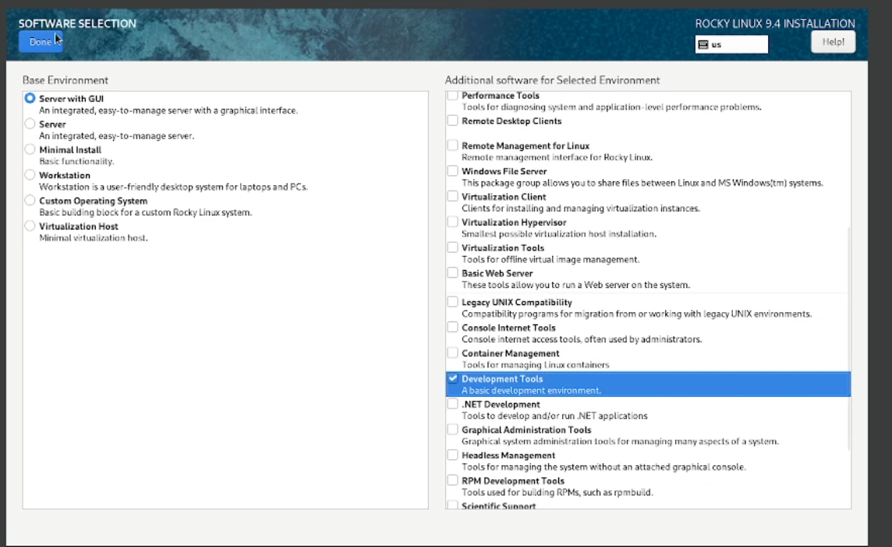
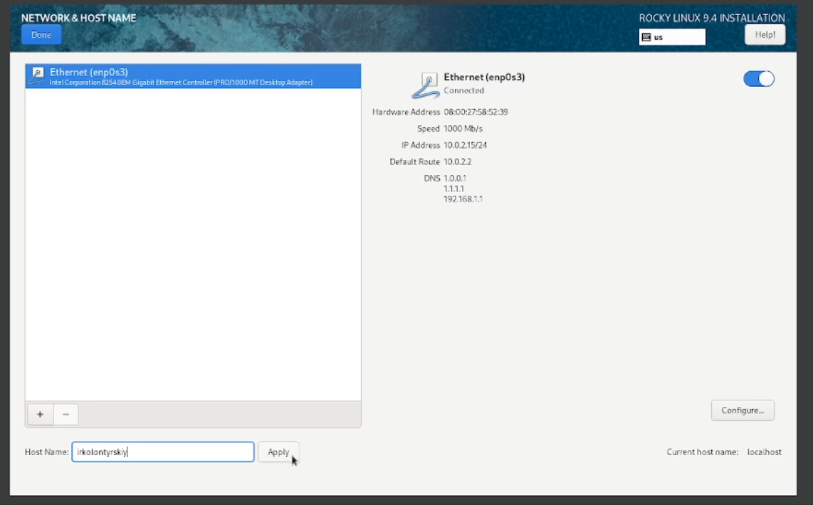
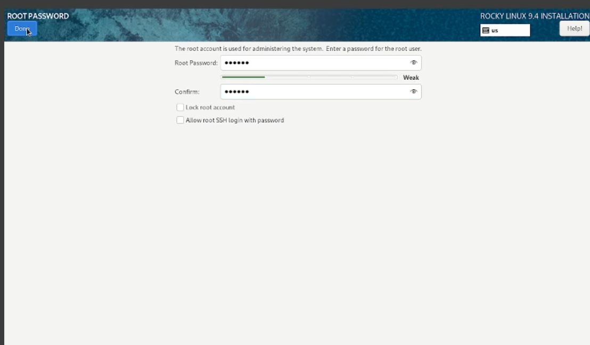
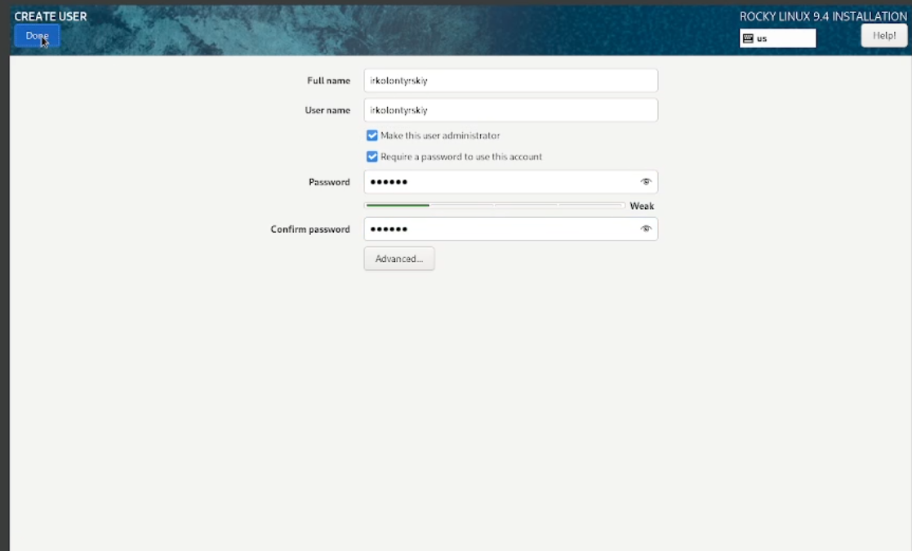
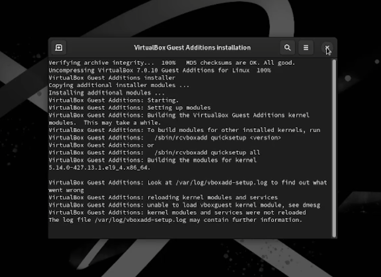

---
## Front matter
title: "Лабораторная работа №1"
subtitle: "Установка и конфигурация операционной системы на виртуальную машину"
author: "Колонтырский Илья Русланович"

## Generic otions
lang: ru-RU
toc-title: "Содержание"

## Bibliography
bibliography: bib/cite.bib
csl: pandoc/csl/gost-r-7-0-5-2008-numeric.csl

## Pdf output format
toc: true # Table of contents
toc-depth: 2
lof: true # List of figures
lot: true # List of tables
fontsize: 12pt
linestretch: 1.5
papersize: a4
documentclass: scrreprt
## I18n polyglossia
polyglossia-lang:
  name: russian
  options:
	- spelling=modern
	- babelshorthands=true
polyglossia-otherlangs:
  name: english
## I18n babel
babel-lang: russian
babel-otherlangs: english
## Fonts
mainfont: PT Serif
romanfont: PT Serif
sansfont: PT Sans
monofont: PT Mono
mainfontoptions: Ligatures=TeX
romanfontoptions: Ligatures=TeX
sansfontoptions: Ligatures=TeX,Scale=MatchLowercase
monofontoptions: Scale=MatchLowercase,Scale=0.9
## Biblatex
biblatex: true
biblio-style: "gost-numeric"
biblatexoptions:
  - parentracker=true
  - backend=biber
  - hyperref=auto
  - language=auto
  - autolang=other*
  - citestyle=gost-numeric
## Pandoc-crossref LaTeX customization
figureTitle: "Рис."
tableTitle: "Таблица"
listingTitle: "Листинг"
lofTitle: "Список иллюстраций"
lotTitle: "Список таблиц"
lolTitle: "Листинги"
## Misc options
indent: true
header-includes:
  - \usepackage{indentfirst}
  - \usepackage{float} # keep figures where there are in the text
  - \floatplacement{figure}{H} # keep figures where there are in the text
---

# Цель работы

Целью данной работы является приобретение практических навыков установки операционной системы на виртуальную машину, настройки минимально необходимых для дальнейшей работы сервисов.

# Задание

* Создать виртуальную машину Linux
* Провести начальную настройку ОС
* Добавить гостевую ОС

# Выполнение лабораторной работы

Укажем имя машины и iso образ.(рис. [-@fig:001]).

{#fig:001 width=70%}

Выделим машине процессоры и память (рис. [-@fig:002]).

{#fig:002 width=70%}

Выделим память для жесткого диска (рис. [-@fig:003]).

{#fig:003 width=70%}

Настроим клавиатуру. Основной язык английский, второй русский. Смена раскладки клавишами alt+shift (рис. [-@fig:004]).

{#fig:004 width=70%}

Выберем пакеты для установки (Development Tools) (рис. [-@fig:005]).

{#fig:005 width=70%}

Изменим host name (рис. [-@fig:006]) 

{#fig:006 width=70%}

Установим пароль для root и добавим пользователя (рис. [-@fig:007]) рис. [-@fig:008]).

{#fig:007 width=70%}

{#fig:008 width=70%}

Установим операционную систему и поставим дополнения гостевой ОС(рис. [-@fig:009]). 

{#fig:009 width=70%}

# Контрольные вопросы

1. Какую информацию содержит учётная запись пользователя?
Учетная запись пользователя содержит информацию о его имени, идентификаторе пользователя, идентификаторе группы, домашнем каталоге, оболочке по умолчанию и других параметрах.

2. Укажите команды терминала и приведите примеры:
 * для получения справки по команде: man <название_команды> (например, man ls)
 * Для перемещения по файловой системе: cd <путь_к_каталогу> (например, cd Documents).
 * Для просмотра содержимого каталога: ls.
 * Для определения объема каталога: du -sh <путь_к_каталогу> (например, du -sh Documents).
 * Для создания каталогов / файлов: mkdir <название_каталога> / touch <название_файла> (например, mkdir NewFolder / touch newfile.txt).
 * Для удаления каталогов / файлов: rm -r <название_каталога> / rm <название_файла> (например, rm -r OldFolder / rm oldfile.txt).
 * Для задания определенных прав на файл / каталог: chmod <права> <файл> (например, chmod 755 myfile.txt).
 * Для просмотра истории команд: history.

3. Что такое файловая система? Приведите примеры с краткой характеристикой.
Файловая система - это способ организации и хранения файлов на носителях данных. Примеры файловых систем:
   - ext4: одна из самых распространенных файловых систем в Linux, обеспечивает хорошую производительность и надежность.
   - NTFS: файловая система, используемая в операционных системах Windows.
   - APFS: файловая система, разработанная Apple для macOS, обладает функциями шифрования и оптимизации хранения данных.
   
4. Как посмотреть, какие файловые системы подмонтированы в ОС?
Чтобы посмотреть, какие файловые системы подмонтированы в ОС, можно использовать команду df -h.

5. Как удалить зависший процесс?
Чтобы удалить зависший процесс, можно воспользоваться командой kill <идентификатор процесса>. 

# Выводы

В ходе выполнения лабораторной работы я создал виртуальную машину и научился её настраивать для последующей комфортной работы.

# Список литературы{.unnumbered}

[Туис, курс Архитектура компьютера и операционные системы](https://esystem.rudn.ru/course/view.php?id=5946)
