---
## Front matter
lang: ru-RU
title: Лабораторная работа №2
subtitle: Управление пользователями и группами
author:
  - Колонтырский И.Р.
institute:
  - Российский университет дружбы народов, Москва, Россия
date: 14 сентября 2024

## i18n babel
babel-lang: russian
babel-otherlangs: english

## Formatting pdf
toc: false
toc-title: Содержание
slide_level: 2
aspectratio: 169
section-titles: true
theme: metropolis
header-includes:
 - \metroset{progressbar=frametitle,sectionpage=progressbar,numbering=fraction}
 - '\makeatletter'
 - '\beamer@ignorenonframefalse'
 - '\makeatother'

##Fonts
mainfont: PT Serif
romanfont: PT Serif
sansfont: PT Sans
monofont: PT Mono
mainfontoptions: Ligatures=TeX
romanfontoptions: Ligatures=TeX
sansfontoptions: Ligatures=TeX,Scale=MatchLowercase
monofontoptions: Scale=MatchLowercase,Scale=0.9
---

## Цель

Получить представление о работе с учётными записями пользователей и группами пользователей в операционной системе типа Linux.

# Выполнение лабораторной работы

# Переключение учётных записей пользователей

## информация об ankomyagin

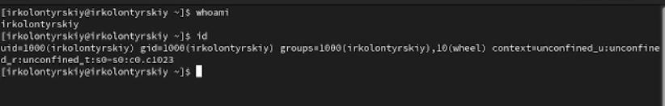{width=100%}

## информация о root

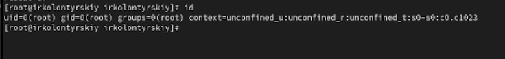{width=100%}

## /etc/sudoers visudo wheel

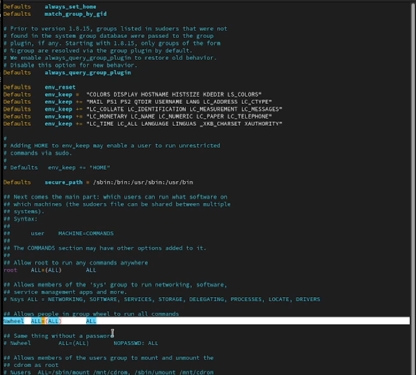{width=100%}

## alice wheel

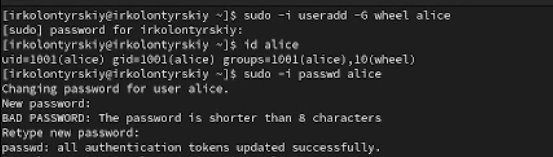{width=100%}

## bob

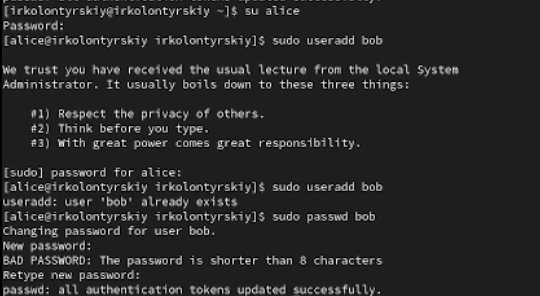{width=100%}

# Создание учётных записей пользователей

## /etc/login.defs

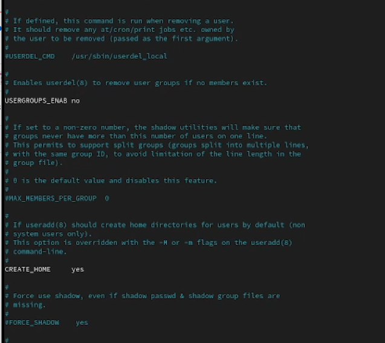{width=80%}

## **/etc/skel**

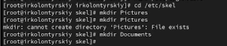{width=80%}

## carol

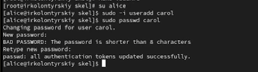{width=80%}

## id carol

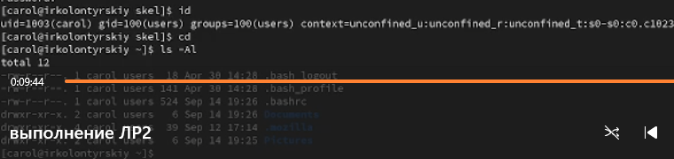{width=80%}

## информация о пароле

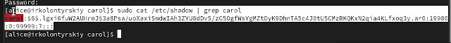{width=80%}

## изменение свойств пароля

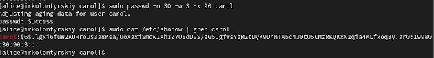{width=80%}

# Работа с группами

## создание групп

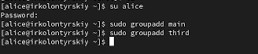{width=80%}

## пользователи в группах

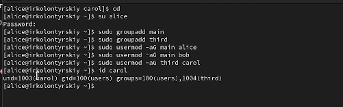{width=80%}

# Контрольные вопросы

## 1. **Получение информации о пользователе**

Для получения информации о номере (идентификаторе) пользователя можно использовать команду **id username**, команда **groups username** покажет только группы. 

## 2. **UID пользователя root**
 
UID пользователя root всегда равен 0. Чтобы узнать UID пользователя, можно использовать команду **id root**
 
## 3. **Различие между командами su и sudo**

* su (substitute user) позволяет переключаться на другого пользователя (по умолчанию на root), запрашивая пароль этого пользователя.

* sudo (superuser do) позволяет выполнять команды от имени другого пользователя (обычно root) без необходимости переключения на его учетную запись, используя при этом свой собственный пароль.

## 4. **Конфигурационный файл для sudo**

Параметры sudo определяются в файле /etc/sudoers.

## 5. **Команда для безопасного изменения конфигурации sudo**

Для безопасного изменения конфигурации sudo следует использовать команду **visudo**. Эта команда проверяет синтаксис файла перед сохранением.

## 6. **Группа для администрирования через sudo**

Чтобы предоставить пользователю доступ ко всем командам администрирования системы через sudo, он должен быть членом группы **sudo** или **wheel** (в зависимости от дистрибутива).

## 7. **Файлы/каталоги для создания учётных записей пользователей**

**Основные файлы**
 
 * /etc/passwd — хранит информацию о пользователях.
 
 * /etc/shadow — хранит зашифрованные пароли пользователей и параметры их сроков действия.
 
 * /etc/group — хранит информацию о группах пользователей.

**Примеры настроек:**

* В файле /etc/login.defs можно настроить параметры, такие как минимальная длина пароля, максимальный срок действия и т.д.

## 8. **Хранение информации о группах пользователей**

Информация о первичной и дополнительных группах пользователей хранится в файле /etc/passwd (первичная группа) и /etc/group (дополнительные группы).

## 9. **Команды для изменения информации о пароле пользователя**

Для изменения пароля пользователя используется команда **passwd username**
     
Для изменения срока действия пароля можно использовать команду **chage username**
     
## 10. **Команда для изменения информации в файле /etc/group**

Для прямого изменения информации в файле /etc/group следует использовать команду **vigr /etc/group**. Использование vigr предпочтительно, так как эта команда блокирует файл во время редактирования и проверяет его на наличие ошибок после редактирования.

# Вывод

## Вывод

В ходе выполнения лабораторной работы я получил представление о работе с учётными записями пользователей и группами пользователей в операционной системе типа Linux.

