---
## Front matter
title: "Лабораторная работа №2"
subtitle: "Управление пользователями и группами"
author: "Колонтырский Илья Русланович"

## Generic otions
lang: ru-RU
toc-title: "Содержание"

## Bibliography
bibliography: bib/cite.bib
csl: pandoc/csl/gost-r-7-0-5-2008-numeric.csl

## Pdf output format
toc: true # Table of contents
toc-depth: 2
lof: true # List of figures
lot: true # List of tables
fontsize: 12pt
linestretch: 1.5
papersize: a4
documentclass: scrreprt
## I18n polyglossia
polyglossia-lang:
  name: russian
  options:
	- spelling=modern
	- babelshorthands=true
polyglossia-otherlangs:
  name: english
## I18n babel
babel-lang: russian
babel-otherlangs: english
## Fonts
mainfont: PT Serif
romanfont: PT Serif
sansfont: PT Sans
monofont: PT Mono
mainfontoptions: Ligatures=TeX
romanfontoptions: Ligatures=TeX
sansfontoptions: Ligatures=TeX,Scale=MatchLowercase
monofontoptions: Scale=MatchLowercase,Scale=0.9
## Biblatex
biblatex: true
biblio-style: "gost-numeric"
biblatexoptions:
  - parentracker=true
  - backend=biber
  - hyperref=auto
  - language=auto
  - autolang=other*
  - citestyle=gost-numeric
## Pandoc-crossref LaTeX customization
figureTitle: "Рис."
tableTitle: "Таблица"
listingTitle: "Листинг"
lofTitle: "Список иллюстраций"
lotTitle: "Список таблиц"
lolTitle: "Листинги"
## Misc options
indent: true
header-includes:
  - \usepackage{indentfirst}
  - \usepackage{float} # keep figures where there are in the text
  - \floatplacement{figure}{H} # keep figures where there are in the text
---

# Цель работы

Получить представление о работе с учётными записями пользователей и группами пользователей в операционной системе типа Linux.

# Выполнение лабораторной работы

## Переключение учётных записей пользователей

Войдем в систему, определим, какую учетную запись используем **whoami**, выведем более подробную информацию **id** (рис. [-@fig:001]).

На скриншоте написано, что пользователь имеет UserID = 1000 (обычный пользователь), GroupID = 1000, входит в группу wheel (позволяет администрировать через sudo)

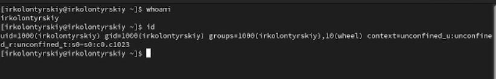{#fig:001 width=70%}

Переключимся на root, выведем информацию через **id** (рис. [-@fig:002]).

На скриншоте написано, что это рут пользователь, имеющий ID = 0, соответственно имеет все полномочия.

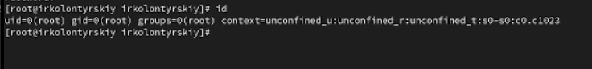{#fig:002 width=70%}

Просмотрим в безопасном режиме файл **/etc/sudoers**, используя, например, **sudo -i visudo**. Убедимся, что в файле присутствует строка **%wheel ALL=(ALL) ALL** (рис. [-@fig:003]).

Для работы с файлом **/etc/sudoers** требуется использовать **visudo** потому что он автоматически проверяет синтаксис файла, что исключает возможность синтаксической ошибки.

Группа **wheel** нужна для предоставления пользователю прав администрировать с помощью sudo

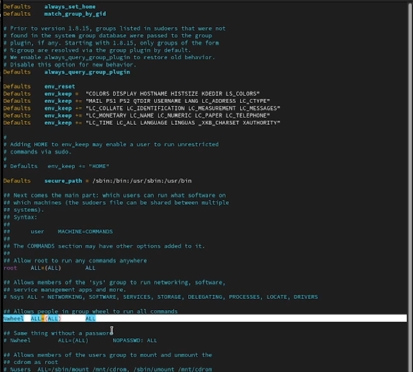{#fig:003 width=70%}

Создадим пользователя alice, входящего в группу wheel и зададим пароль(рис. [-@fig:004]).

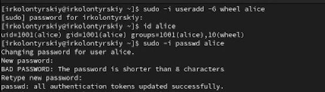{#fig:004 width=70%}

Создадим пользователя bob и посмотрим, в каких группах он состоит(рис. [-@fig:005]).

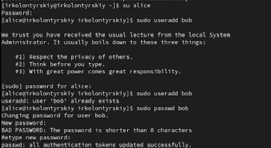{#fig:005 width=70%}

## Создание учётных записей пользователей

Переключимся в режим root и откроем файл конфигурации /etc/login.defs для редактирования(рис. [-@fig:006]) 

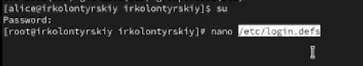{#fig:006 width=70%}

Изменим несколько параметров. Найдём параметр **CREATE_HOME** и убедимся, что он установлен в значение yes. Также установим параметр **USERGROUPS_ENAB no** (рис. [-@fig:007])

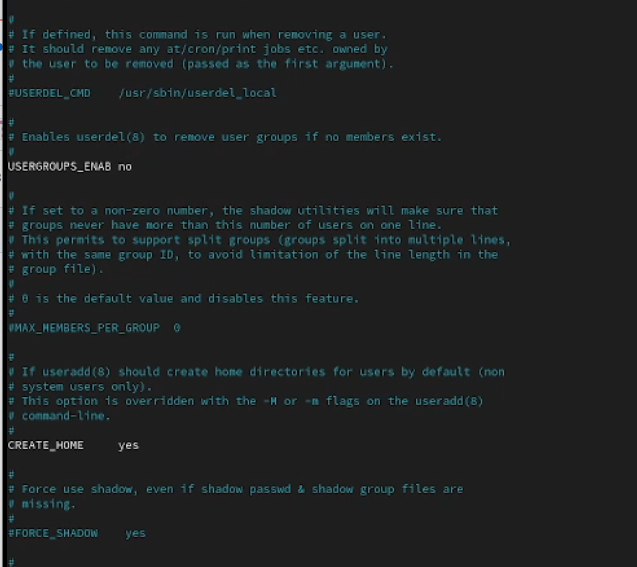{#fig:007 width=70%}

Перейдём в каталог **/etc/skel** и создадим каталоги (рис. [-@fig:008]).

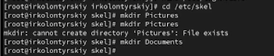{#fig:008 width=70%}

Изменим одержимое файла .bashrc (рис. [-@fig:009])

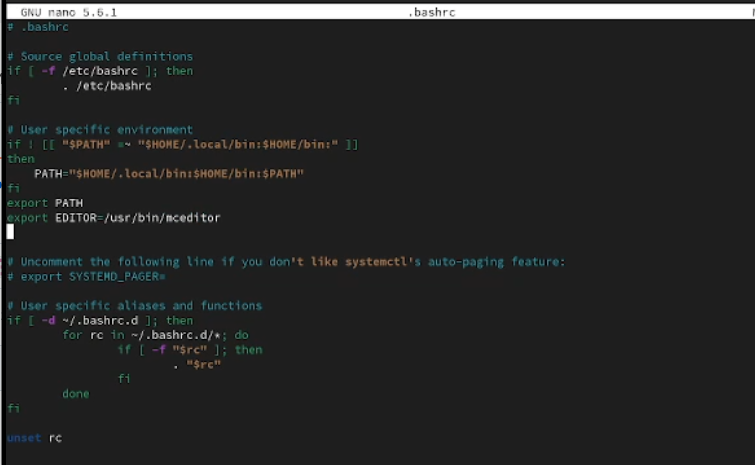{#fig:009 width=70%}

Переключимся на учётную запись пользователя alice, создадим пользователя carol и установим пароль (рис. [-@fig:010])

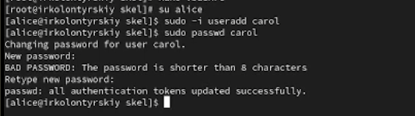{#fig:010 width=70%}

Посмотрим информацию о пользователе Кэрол (). Убедимся, что ранее созданные каталоги были созданы в домашнем каталоге Кэрол (рис. [-@fig:011])

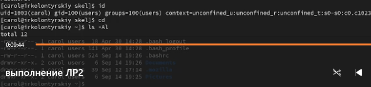{#fig:011 width=70%}

Переключимся на alice, в строке записи о пароле пользователя carol указана информация о последнем изменении пароля, количество дней до того, как пароль может быть изменен (0), кол-во дней, через сколько нужно изменить пароль (999999), за сколько дней до конца срока придет сообщение об изменении пароля (7) (рис. [-@fig:012])

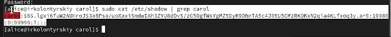{#fig:012 width=70%}

Изменим свойства пароля пользователя Кэрол и убедимся в успешном изменении (рис. [-@fig:013])

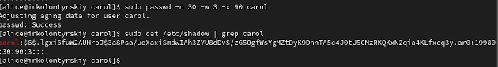{#fig:013 width=70%}

Убедимся, что идентификатор alice существует во всех трёх файлах, что идентификатор carol существует не во всех трёх файлах (рис. [-@fig:014])

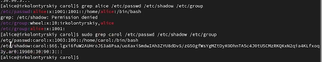{#fig:014 width=70%}

## Работа с группами

Находясь под учётной записью пользователя alice, создадим группы main и third (рис. [-@fig:015])

{#fig:015 width=70%}

Добавим пользователей alice и bob в группу main, а carol — в группу third. Убедимся, что пользователь carol правильно добавлен в группу third (рис. [-@fig:016])

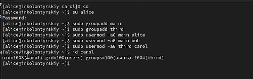{#fig:016 width=70%}

Информация об остальных участниках:

* alice - группа wheel (права на sudo), main

* bob - группа main

# Контрольные вопросы

1. **Получение информации о пользователе**

Для получения информации о номере (идентификаторе) пользователя можно использовать команду **id username**, команда **groups username** покажет только группы. 

2. **UID пользователя root**
 
UID пользователя root всегда равен 0. Чтобы узнать UID пользователя, можно использовать команду **id root**
 
3. **Различие между командами su и sudo**

* su (substitute user) позволяет переключаться на другого пользователя (по умолчанию на root), запрашивая пароль этого пользователя.

* sudo (superuser do) позволяет выполнять команды от имени другого пользователя (обычно root) без необходимости переключения на его учетную запись, используя при этом свой собственный пароль.

4. **Конфигурационный файл для sudo**

Параметры sudo определяются в файле /etc/sudoers.

5. **Команда для безопасного изменения конфигурации sudo**

Для безопасного изменения конфигурации sudo следует использовать команду **visudo**. Эта команда проверяет синтаксис файла перед сохранением.

6. **Группа для администрирования через sudo**

Чтобы предоставить пользователю доступ ко всем командам администрирования системы через sudo, он должен быть членом группы **sudo** или **wheel** (в зависимости от дистрибутива).

7. **Файлы/каталоги для создания учётных записей пользователей**

**Основные файлы**
 
 * /etc/passwd — хранит информацию о пользователях.
 
 * /etc/shadow — хранит зашифрованные пароли пользователей и параметры их сроков действия.
 
 * /etc/group — хранит информацию о группах пользователей.

**Примеры настроек:**

* В файле /etc/login.defs можно настроить параметры, такие как минимальная длина пароля, максимальный срок действия и т.д.

8. **Хранение информации о группах пользователей**

Информация о первичной и дополнительных группах пользователей хранится в файле /etc/passwd (первичная группа) и /etc/group (дополнительные группы).

9. **Команды для изменения информации о пароле пользователя**

Для изменения пароля пользователя используется команда **passwd username**
     
Для изменения срока действия пароля можно использовать команду **chage username**
     
10. **Команда для изменения информации в файле /etc/group**

Для прямого изменения информации в файле /etc/group следует использовать команду **vigr /etc/group**. Использование vigr предпочтительно, так как эта команда блокирует файл во время редактирования и проверяет его на наличие ошибок после редактирования.

# Вывод

В ходе выполнения лабораторной работы я получил представление о работе с учётными записями пользователей и группами пользователей в операционной системе типа Linux.

# Список литературы{.unnumbered}

[Туис, курс Администрирование операционных систем](https://esystem.rudn.ru/course/view.php?id=5946)
