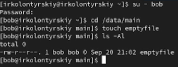

---
## Front matter
title: "Лабораторная работа №3"
subtitle: "Настройка прав доступа"
author: "Колонтырский Илья Русланович"

## Generic otions
lang: ru-RU
toc-title: "Содержание"

## Bibliography
bibliography: bib/cite.bib
csl: pandoc/csl/gost-r-7-0-5-2008-numeric.csl

## Pdf output format
toc: true # Table of contents
toc-depth: 2
lof: true # List of figures
lot: true # List of tables
fontsize: 12pt
linestretch: 1.5
papersize: a4
documentclass: scrreprt
## I18n polyglossia
polyglossia-lang:
  name: russian
  options:
	- spelling=modern
	- babelshorthands=true
polyglossia-otherlangs:
  name: english
## I18n babel
babel-lang: russian
babel-otherlangs: english
## Fonts
mainfont: PT Serif
romanfont: PT Serif
sansfont: PT Sans
monofont: PT Mono
mainfontoptions: Ligatures=TeX
romanfontoptions: Ligatures=TeX
sansfontoptions: Ligatures=TeX,Scale=MatchLowercase
monofontoptions: Scale=MatchLowercase,Scale=0.9
## Biblatex
biblatex: true
biblio-style: "gost-numeric"
biblatexoptions:
  - parentracker=true
  - backend=biber
  - hyperref=auto
  - language=auto
  - autolang=other*
  - citestyle=gost-numeric
## Pandoc-crossref LaTeX customization
figureTitle: "Рис."
tableTitle: "Таблица"
listingTitle: "Листинг"
lofTitle: "Список иллюстраций"
lotTitle: "Список таблиц"
lolTitle: "Листинги"
## Misc options
indent: true
header-includes:
  - \usepackage{indentfirst}
  - \usepackage{float} # keep figures where there are in the text
  - \floatplacement{figure}{H} # keep figures where there are in the text
---

# Цель работы

Получение навыков настройки базовых и специальных прав доступа для групп пользователей в операционной системе типа Linux.

# Выполнение лабораторной работы

## Управление базовыми разрешениями

Создим структуру каталогов с разными разрешениями доступа для разных групп пользователей.

Откроем терминал с учётной записью root, создадим каталоги и посмотрим, кто является их владельцем (рис. [-@fig:001]).

{#fig:001 width=70%}

Изменим владельцев этих каталогов с **root** на **main** и **third**(рис. [-@fig:002]).

{#fig:002 width=70%}

Установим разрешения, позволяющие владельцам каталогов записывать файлы в эти каталоги и запрещающие доступ к содержимому каталогов всем другим пользователям и группам (рис. [-@fig:003]).

{#fig:003 width=70%}

В другом терминале перейдём под учётную запись пользователя bob и попробуем перейти в каталог **/data/main** и создать файл **emptyfile**. У нас получится это сделать, так как боб состоит в группе main, а права доступа == 770 (рис. [-@fig:004]).

{#fig:004 width=70%}

Под пользователем bob попробуем перейти в каталог **/data/third** и создать файл
**emptyfile** в этом каталоге. У нас не получится даже перейти в каталог, так как боб не состоит в группе **third**

Создадим пользователя bob и посмотрим, в каких группах он состоит(рис. [-@fig:005]).

{#fig:005 width=70%}

## Управление специальными разрешениями

Разберем работу со **sticky bit** 

Откроем терминал под пользователем alice и создадим в каталоге **/data/main** два файла(рис. [-@fig:006]) 

{#fig:006 width=70%}

Перейдём под учётную запись пользователя bob и попытаемся удалить файлы пользователя alice. Убедимся, что они удалены (рис. [-@fig:007])

{#fig:007 width=70%}

Создадим два файла с учетной записи пользователя **bob** (рис. [-@fig:008]).

{#fig:008 width=70%}

В терминале под пользователем root установим для каталога /data/main бит идентификатора группы, а также stiky-бит для разделяемого (общего) каталога группы (рис. [-@fig:009])

{#fig:009 width=70%}

Переключимся на учётную запись пользователя alice, создадим два файла. Видим, что они принадлежат группе main. Также попробуем удалить файлы, принадлежащие бобу. У нас это не выйдет, так как sticky-bit предотвратит удаление этих файлов пользователем alice,
поскольку этот пользователь не является владельцем этих файлов (рис. [-@fig:010])

{#fig:010 width=70%}

## Управление расширенными разрешениями с использованием списков ACL

Откроем терминал с учётной записью **root**, установим права на чтение и выполнение в каталогах и используем команду **getfacl**, чтобы убедиться в правильности установки разрешений (рис. [-@fig:011])

{#fig:011 width=70%}

Создадим новый файл с именем **newfile1** в каталоге **/data/main**, проверим текущие назначенные ему полномочия. Люди из группы и остальные имеют только право на чтение (мы это назначили) (файл неисполняем) (рис. [-@fig:012])

{#fig:012 width=70%}

Выполним аналогичные действия для каталога **/data/third**. Полномочия такие же, отличается только группа. (рис. [-@fig:013])

{#fig:013 width=70%}

Установим ACL по умолчанию для каталогов и убедимся, что настройки работают, добавив новый файл в каталог.  (рис. [-@fig:014])

{#fig:014 width=70%}

Проведем аналогичные действия для каталога /data/third (рис. [-@fig:015]).

{#fig:015 width=70%}

Для проверки полномочий группы **third** в каталоге **/data/third** войдём в другом терминале под учётной записью члена группы **third** и проверим операции с файлами 

Удалить файлы не получится, так как он не является владельцем, однако сможет внести изменения во второй файл, потому что мы создали его после изменения настроек полномочий(рис. [-@fig:016])

{#fig:016 width=70%}

# Контрольные вопросы

1. **Как следует использовать команду chown, чтобы установить владельца группы для файла?**

Чтобы установить владельца и группу для файла, нужно использовать команду chown следующим образом:

**chown :groupname filename**

2. **С помощью какой команды можно найти все файлы, принадлежащие конкретному пользователю?**
 
Для этого можно использовать команду find:

**find /path/to/search -user username**
 
3. **Как применить разрешения на чтение, запись и выполнение для всех файлов в каталоге /data для пользователей и владельцев групп, не устанавливая никаких прав для других?**

Используем команду chmod:

**chmod 770 /data/\***

4. **Какая команда позволяет добавить разрешение на выполнение для файла, который необходимо сделать исполняемым?**

**chmod +x filename**

5. **Какая команда позволяет убедиться, что групповые разрешения для всех новых файлов, создаваемых в каталоге, будут присвоены владельцу группы этого каталога?**

**chmod g+s /path/to/directory**

6. **Необходимо, чтобы пользователи могли удалять только те файлы, владельцами которых они являются, или которые находятся в каталоге, владельцами которого они являются. С помощью какой команды можно это сделать?**

**chmod g+s,o+t /путь**

7. **Какая команда добавляет ACL, который предоставляет членам группы права доступа на чтение для всех существующих файлов в текущем каталоге?**

**setfacl -m g:groupname:r /path/to/directory/\***
   
8. **Что нужно сделать для гарантии того, что члены группы получат разрешения на чтение для всех файлов в текущем каталоге и во всех его подкаталогах, а также для всех файлов, которые будут созданы в этом каталоге в будущем?**

Использовать команду setfacl с флагом -R (рекурсивно)

**setfacl -R -m g:groupname:rX /path/to/directory**
   

9. **Какое значение umask нужно установить, чтобы «другие» пользователи не получали какие-либо разрешения на новые файлы?**

**umask 007**
     
10. **Какая команда гарантирует, что никто не сможет удалить файл myfile случайно?**

**chattr +i myfile**

# Вывод

В ходе выполнения лабораторной работы я получил навыки настройки базовых и специальных прав доступа для групп пользователей в операционной системе типа Linux.

# Список литературы{.unnumbered}

[Туис, курс Администрирование операционных систем](https://esystem.rudn.ru/course/view.php?id=5946)
