---
## Front matter
lang: ru-RU
title: Лабораторная работа №4
subtitle: Работа с программными пакетами
author:
  - Колонтырский И. Р.
institute:
  - Российский университет дружбы народов, Москва, Россия
date: 28 сентября 2024

## i18n babel
babel-lang: russian
babel-otherlangs: english

## Formatting pdf
toc: false
toc-title: Содержание
slide_level: 2
aspectratio: 169
section-titles: true
theme: metropolis
header-includes:
 - \metroset{progressbar=frametitle,sectionpage=progressbar,numbering=fraction}
 - '\makeatletter'
 - '\beamer@ignorenonframefalse'
 - '\makeatother'

##Fonts
mainfont: PT Serif
romanfont: PT Serif
sansfont: PT Sans
monofont: PT Mono
mainfontoptions: Ligatures=TeX
romanfontoptions: Ligatures=TeX
sansfontoptions: Ligatures=TeX,Scale=MatchLowercase
monofontoptions: Scale=MatchLowercase,Scale=0.9
---

## Цель

Получить навыки работы с репозиториями и менеджерами пакетов.

# Выполнение лабораторной работы

# Работа с репозиториями

## каталог репозиториев

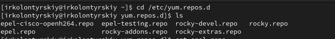{width=100%}

## содержимое файла репозитория

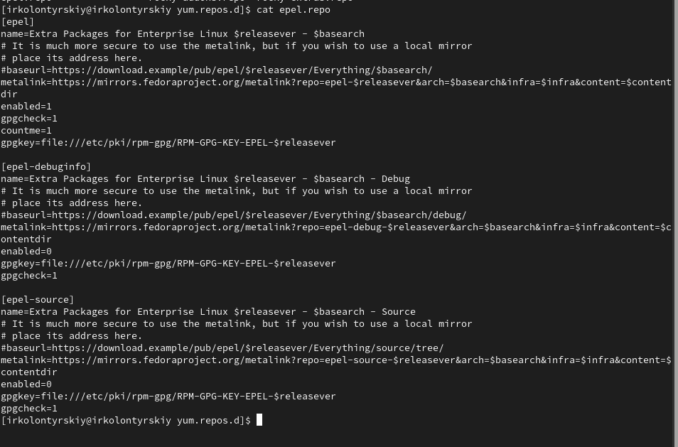{width=100%}

## список репозиториев

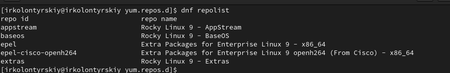{width=100%}

## установка nmap

{width=100%}

## Удаление nmap

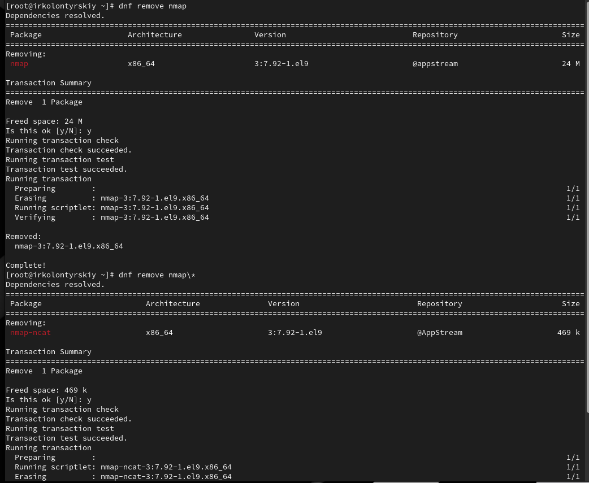{width=100%}

# Список групп пакетов

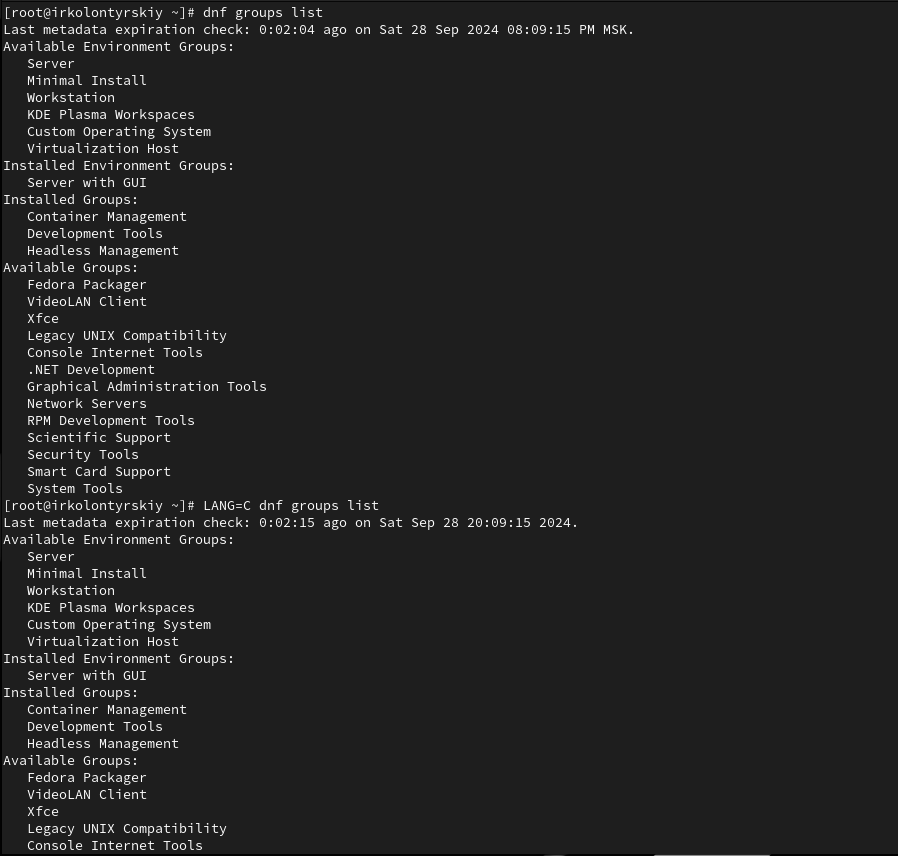{width=100%}

## установка RPM Development Tools

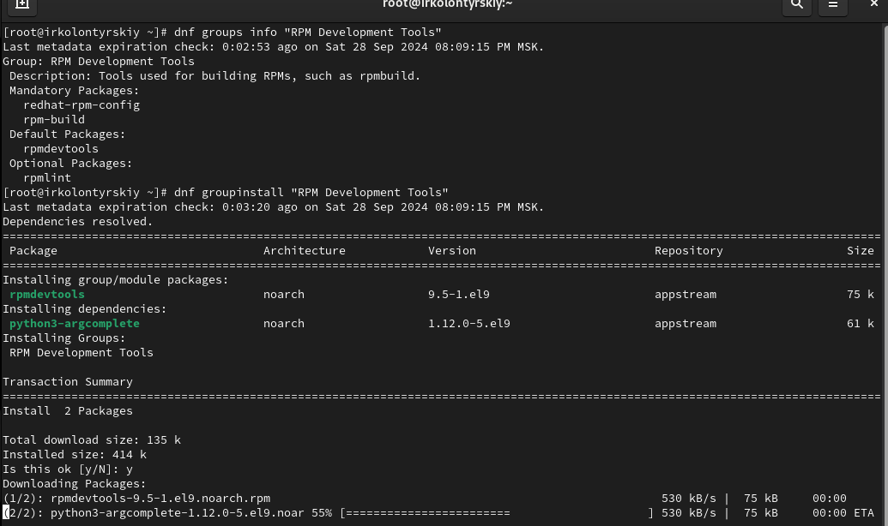{width=80%}

## Просмотр истории и отмена действия

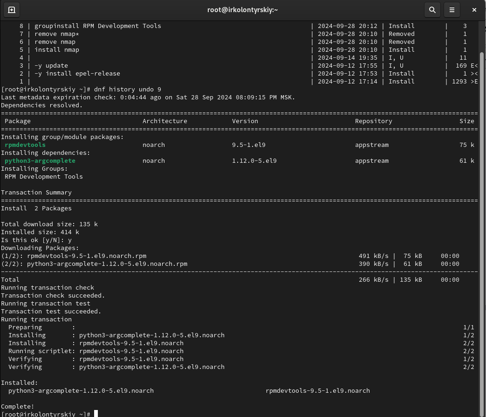{width=80%}

# Использование rpm

# Предположим, что требуется установить текстовый браузер lynx из rpm-пакета

##  установка lynx из rpm-пакета

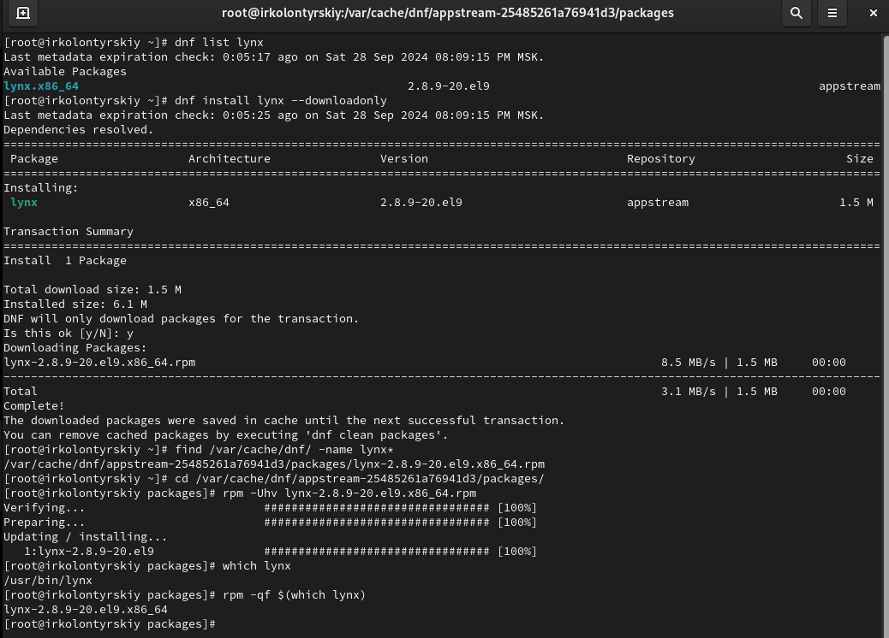{width=80%}

## доп информация об lynx

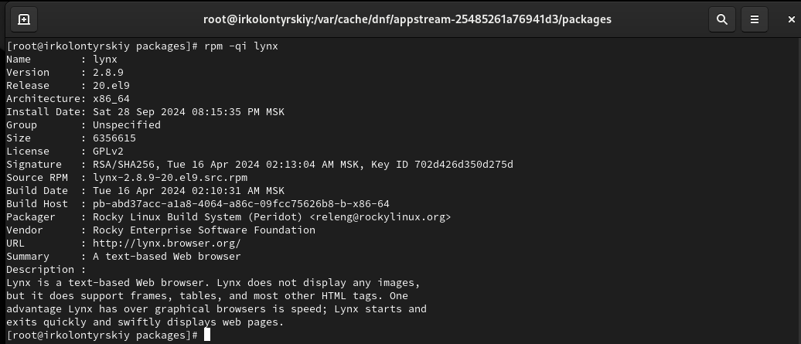{width=80%}

## список файлов пакета

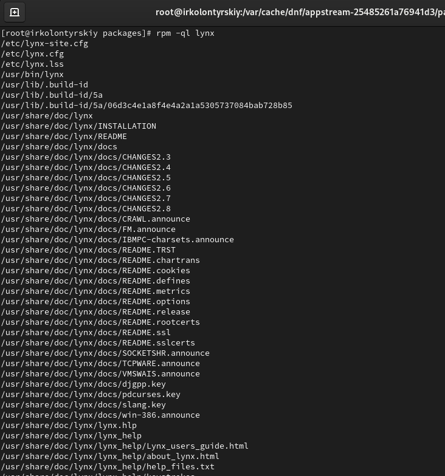{width=80%}

## файлы документации пакета

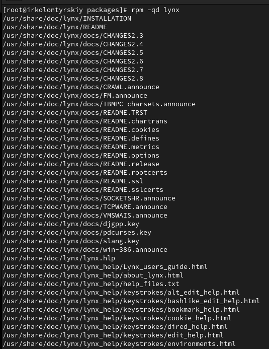{width=80%}

## конфигурация, скрипты

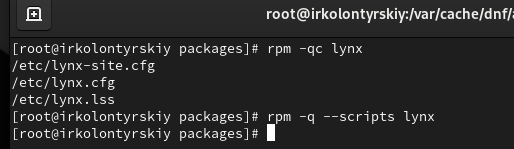{width=80%}

## пробный запуск

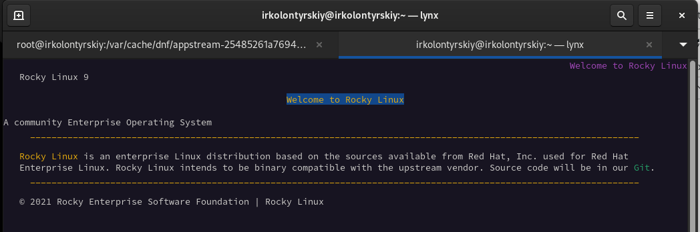{width=80%}

# Предположим, что требуется из rpm-пакетов установить dnsmasq

## установка dnsmasq

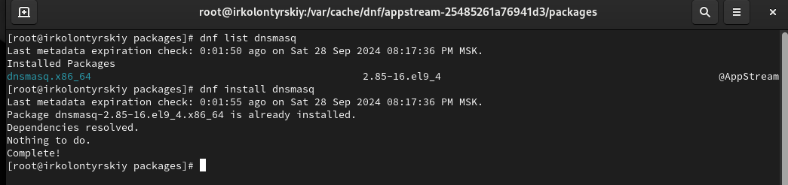{width=80%}

## информация о dnsmasqи

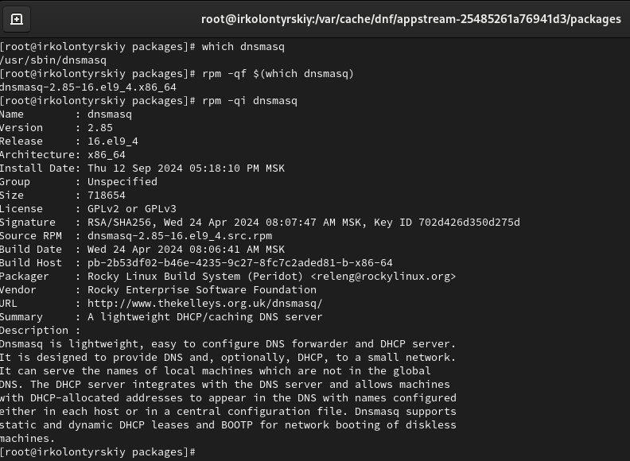{width=80%}

## список файлов в пакете

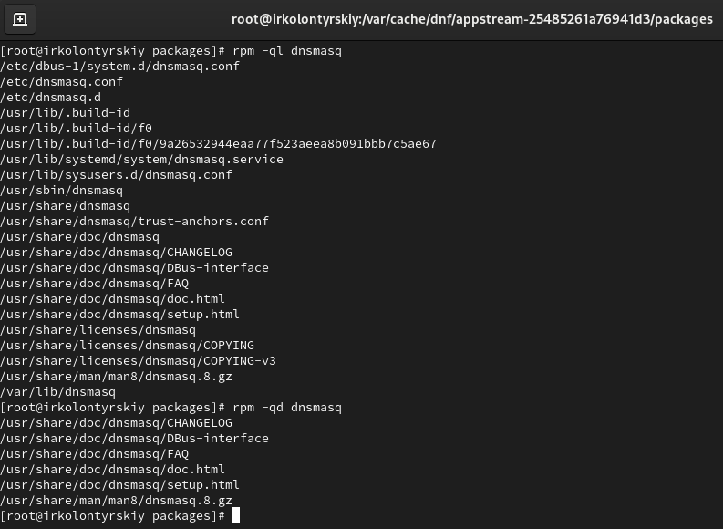{width=80%}

## документация пакета

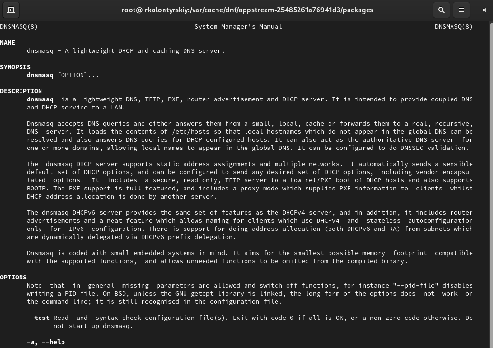{width=80%}

## конфигурационные файлы, скрипт

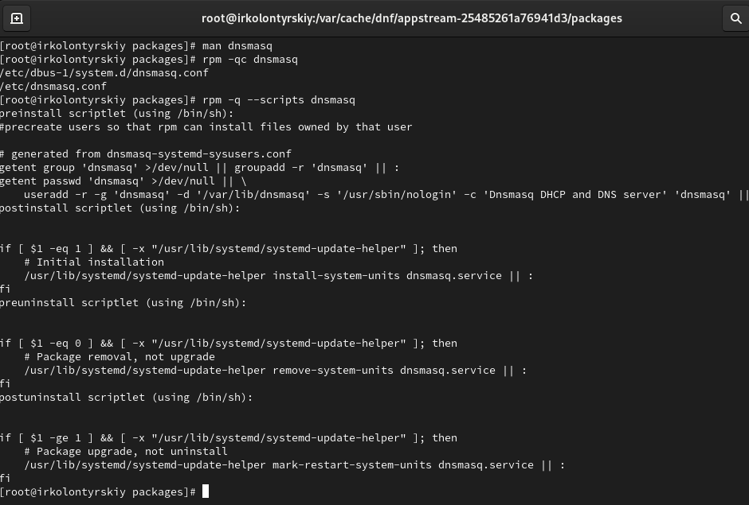{width=80%}

# Контрольные вопросы

## 1. **Какая команда позволяет вам искать пакет rpm, содержащий файл useradd?**

**rpm -qf $(which useradd)**

## 2. **Какие команды вам нужно использовать, чтобы показать имя группы dnf, которая содержит инструменты безопасности и показывает, что находится в этой группе?**

**dnf group list**
**dnf group info "Имя группы"**
 
## 3. **Какая команда позволяет вам установить rpm, который вы загрузили из Интернета и который не находится в репозиториях?**

**rpm -ivh имя_пакета.rpm**

## 4. **Вы хотите убедиться, что пакет rpm, который вы загрузили, не содержит никакого опасного кода сценария. Какая команда позволяет это сделать?**

**rpm -K имя_пакета.rpm**

## 5. **Какая команда показывает всю документацию в rpm?**

**rpm -qd имя_пакета**

## 6. **Какая команда показывает, какому пакету rpm принадлежит файл?**

**rpm -qf /путь/к/файлу**

# Вывод

## Вывод

В ходе выполнения лабораторной работы я получил навыки работы с репозиториями и менеджерами пакетов.

