---
## Front matter
title: "Лабораторная работа №4"
subtitle: "Работа с программными пакетами"
author: "Колонтырский Илья Русланович"

## Generic otions
lang: ru-RU
toc-title: "Содержание"

## Bibliography
bibliography: bib/cite.bib
csl: pandoc/csl/gost-r-7-0-5-2008-numeric.csl

## Pdf output format
toc: true # Table of contents
toc-depth: 2
lof: true # List of figures
lot: true # List of tables
fontsize: 12pt
linestretch: 1.5
papersize: a4
documentclass: scrreprt
## I18n polyglossia
polyglossia-lang:
  name: russian
  options:
	- spelling=modern
	- babelshorthands=true
polyglossia-otherlangs:
  name: english
## I18n babel
babel-lang: russian
babel-otherlangs: english
## Fonts
mainfont: PT Serif
romanfont: PT Serif
sansfont: PT Sans
monofont: PT Mono
mainfontoptions: Ligatures=TeX
romanfontoptions: Ligatures=TeX
sansfontoptions: Ligatures=TeX,Scale=MatchLowercase
monofontoptions: Scale=MatchLowercase,Scale=0.9
## Biblatex
biblatex: true
biblio-style: "gost-numeric"
biblatexoptions:
  - parentracker=true
  - backend=biber
  - hyperref=auto
  - language=auto
  - autolang=other*
  - citestyle=gost-numeric
## Pandoc-crossref LaTeX customization
figureTitle: "Рис."
tableTitle: "Таблица"
listingTitle: "Листинг"
lofTitle: "Список иллюстраций"
lotTitle: "Список таблиц"
lolTitle: "Листинги"
## Misc options
indent: true
header-includes:
  - \usepackage{indentfirst}
  - \usepackage{float} # keep figures where there are in the text
  - \floatplacement{figure}{H} # keep figures where there are in the text
---

# Цель работы

Получить навыки работы с репозиториями и менеджерами пакетов.

# Выполнение лабораторной работы

## Работа с репозиториями

Изучим содержимое каталога репозиториев и файлов репозиториев. В них содержатся данные для установки программ (рис. [-@fig:001]), (рис. [-@fig:002]).

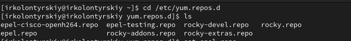{#fig:001 width=70%}

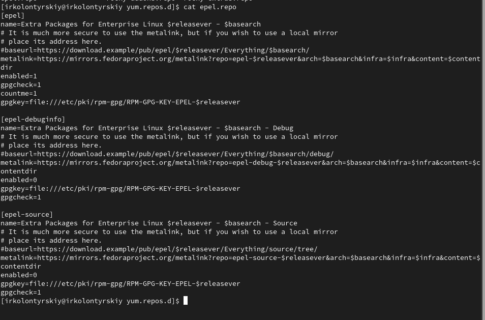{#fig:002 width=70%}

Выведем на экран список репозиториев (рис. [-@fig:003]).

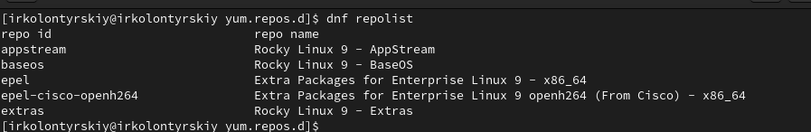{#fig:003 width=70%}

Установим nmap, предварительно изучив информацию по имеющимся пакетам. Разница между dnf install nmap и dnf install nmap\* состоит в том, что вторая команда устанавливает все пакеты, а первая только основной(рис. [-@fig:004]).

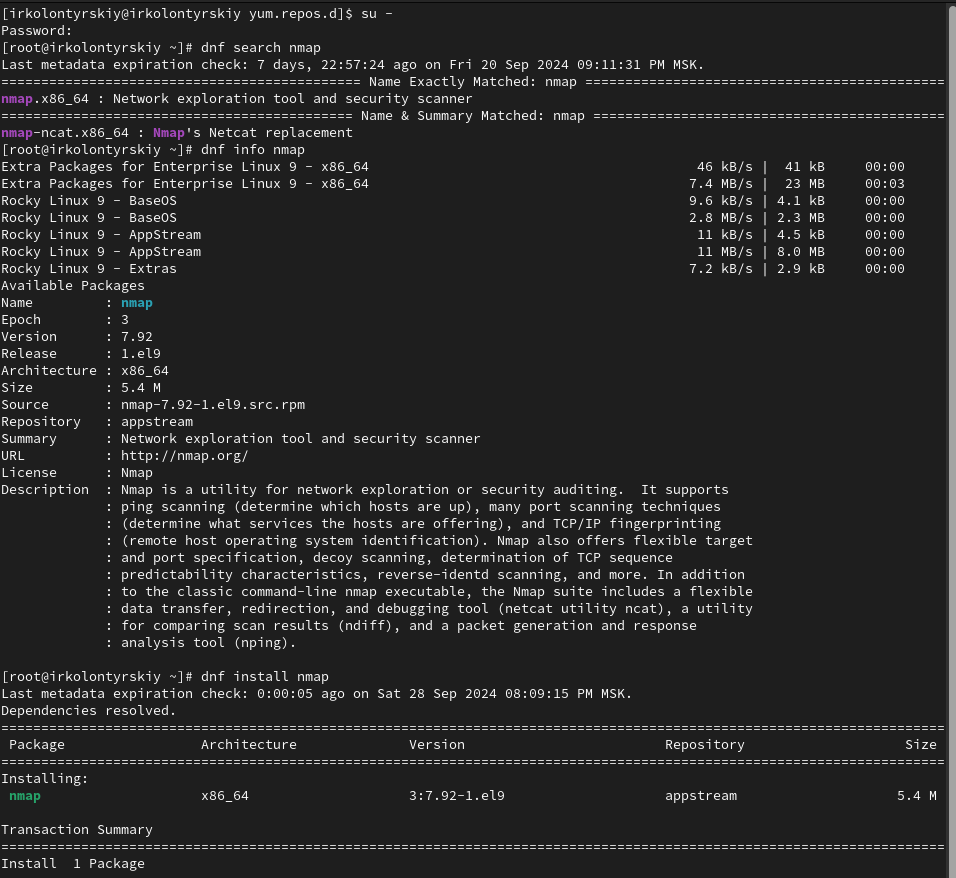{#fig:004 width=70%}

Удалим nmap (рис. [-@fig:005]).

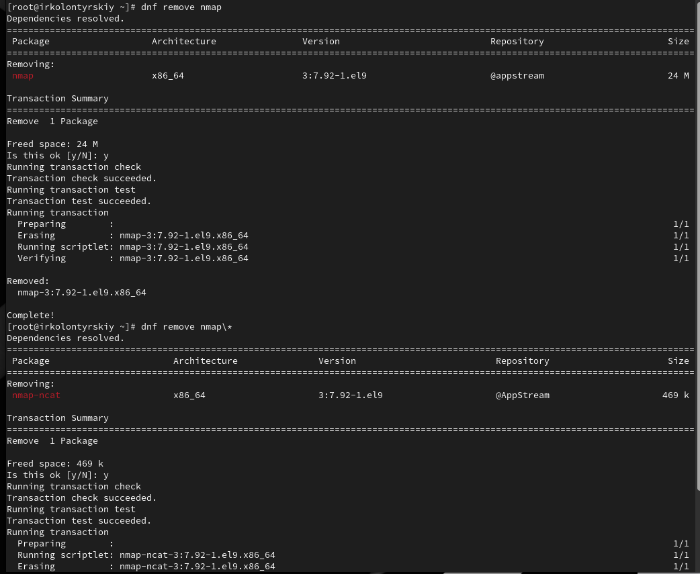{#fig:005 width=70%}

Получим список имеющихся групп пакетов(рис. [-@fig:006]) 

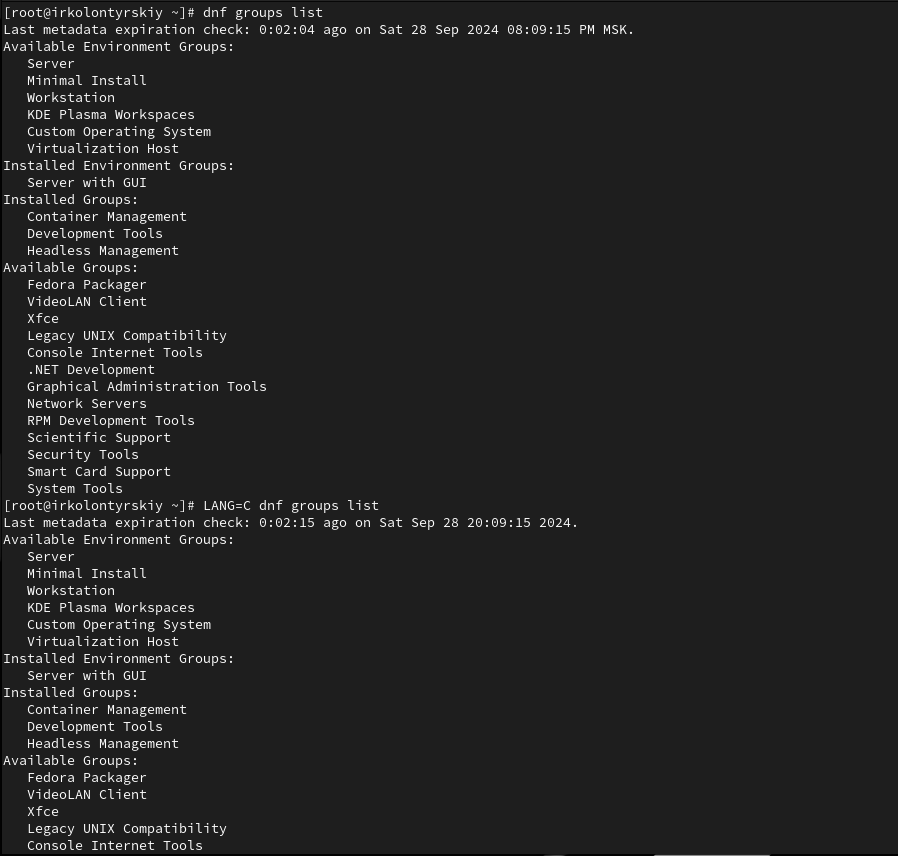{#fig:006 width=70%}

Установим группу пакетов RPM Development Tools (рис. [-@fig:007])

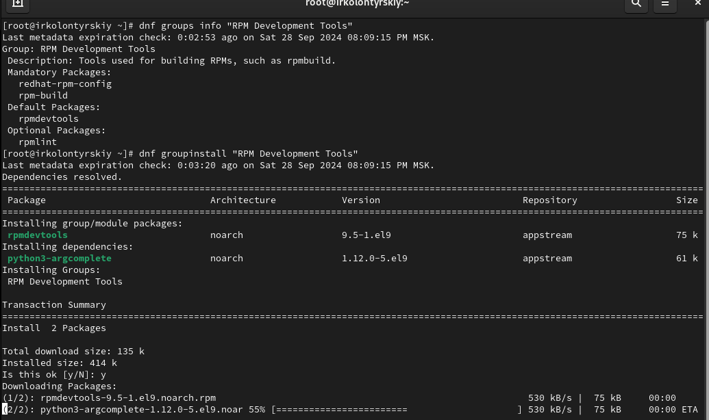{#fig:007 width=70%}

Удалим группу пакетов RPM Development Tools (рис. [-@fig:008]).

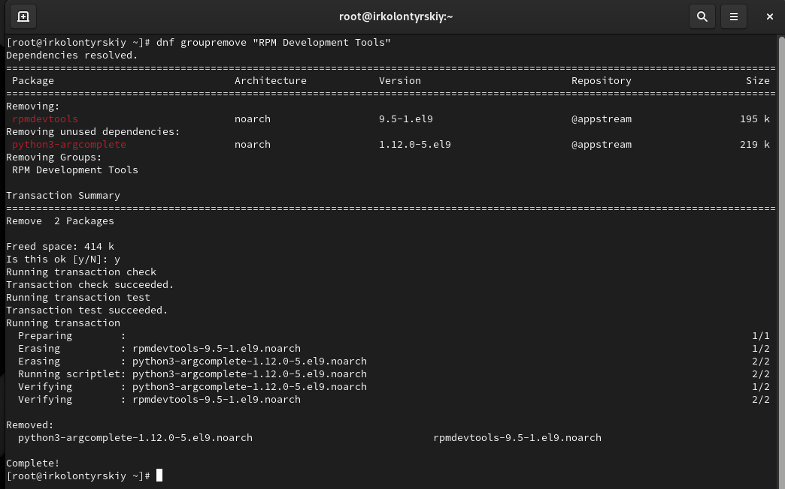{#fig:008 width=70%}

Посмотрим историю использования команды dnf, отменим последнее действие(рис. [-@fig:009])

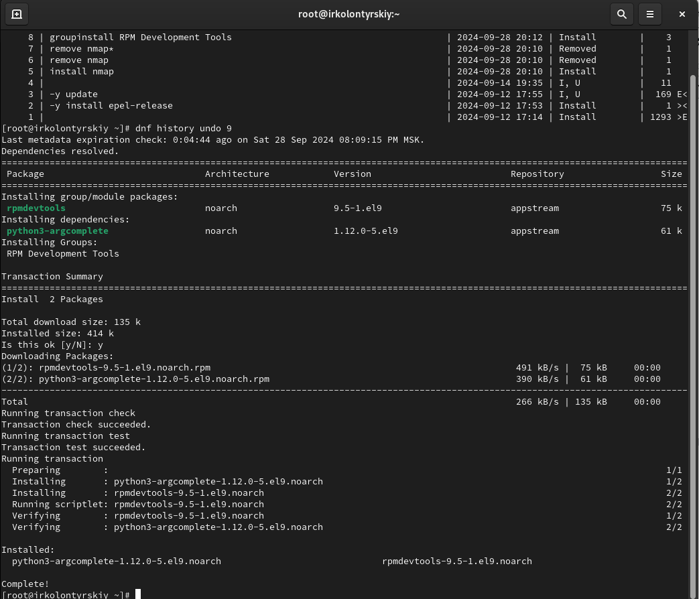{#fig:009 width=70%}

## Использование rpm

### Предположим, что требуется установить текстовый браузер lynx из rpm-пакета.

Скачаем rpm-пакет lynx. Найдём каталог, в который был помещён пакет после загрузки, перейдём в этот каталог и установим rpm-пакет, определим расположение исполняемого файла(рис. [-@fig:010])

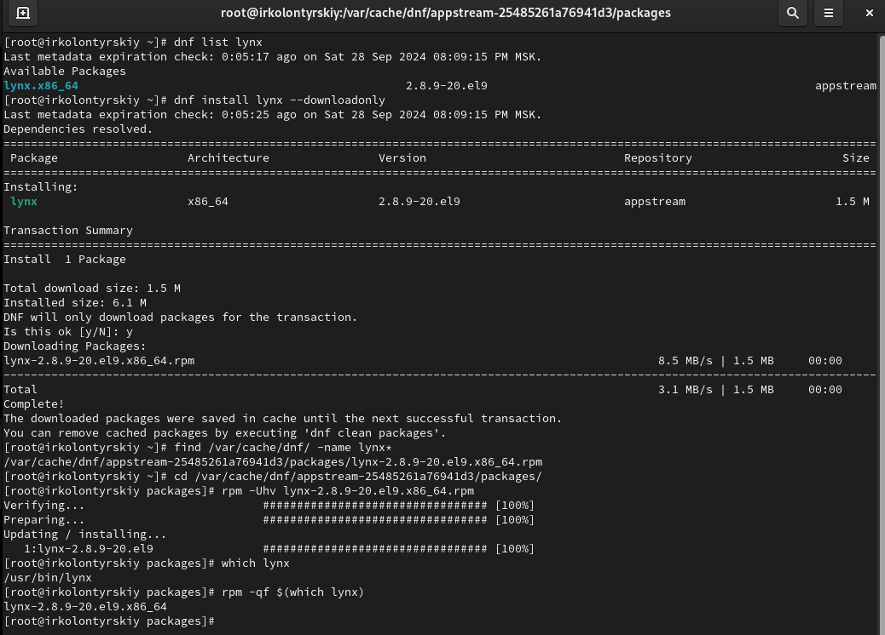{#fig:010 width=70%}

Определим по имени файла, к какому пакету принадлежит dnsmasq, получим дополнительную информацию о содержимо пакета(рис. [-@fig:011])

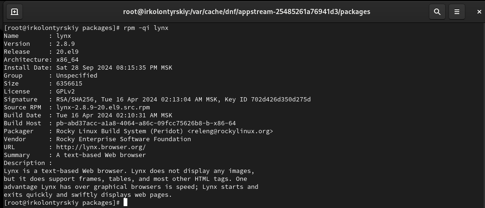{#fig:011 width=70%}

 Получим список всех файлов в пакете(рис. [-@fig:012])

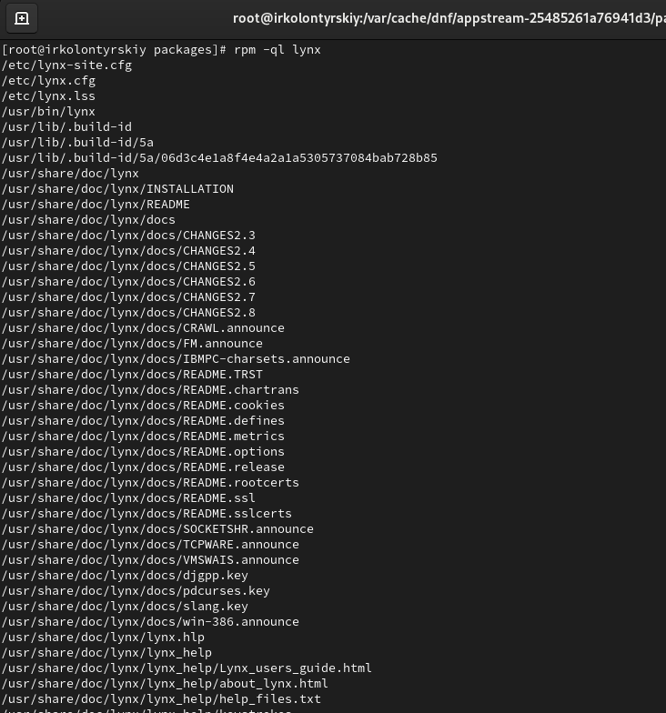{#fig:012 width=70%}

Перечень файлов с документацией пакета (рис. [-@fig:013])

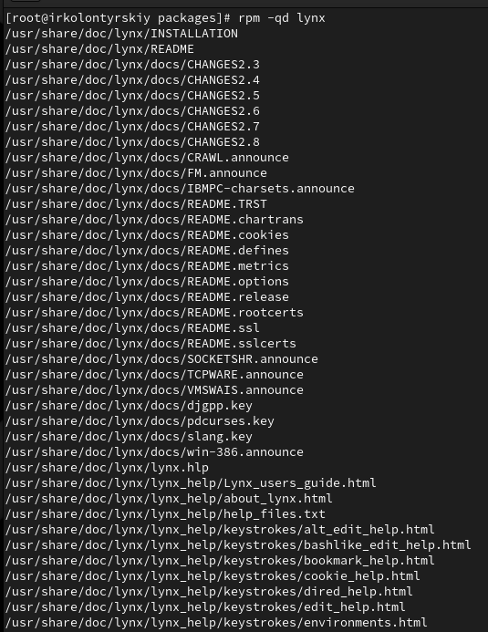{#fig:013 width=70%}

Выведем на экран перечень и месторасположение конфигурационных файлов пакета, выведем расположение и содержание скриптов (их нет)(рис. [-@fig:014])

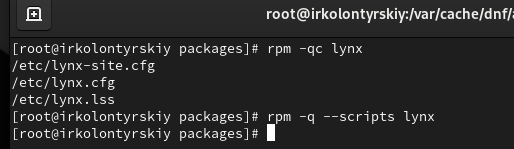{#fig:014 width=70%}

Запустим текстовый браузер lynx, чтобы проверить корректность установки пакета (рис. [-@fig:015]).

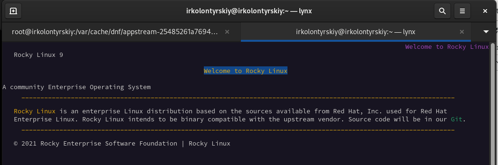{#fig:015 width=70%}

### Предположим, что требуется из rpm-пакетов установить dnsmasq

установим пакет dnsmasq(рис. [-@fig:016])

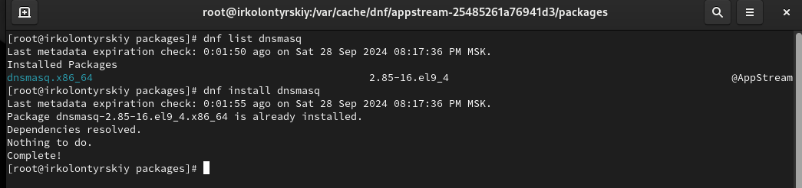{#fig:016 width=70%}

Определим по имени файла, к какому пакету принадлежит dnsmasqи получим дополнительную информацию о содержимом пакета (рис. [-@fig:017])

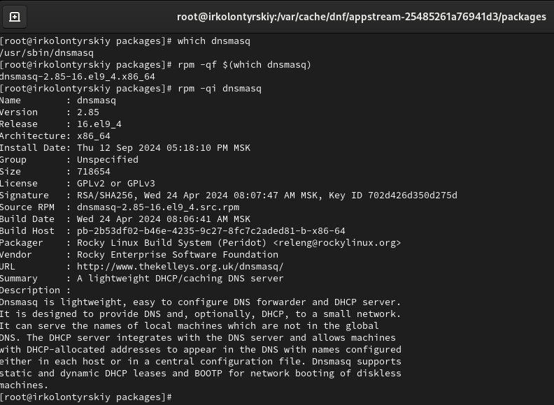{#fig:017 width=70%}

Получим список всех файлов в пакете (рис. [-@fig:018])

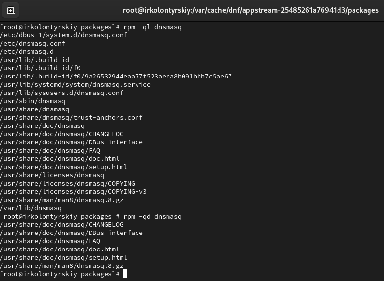{#fig:018 width=70%}

выведем перечень файлов с документацией пакета (рис. [-@fig:019])

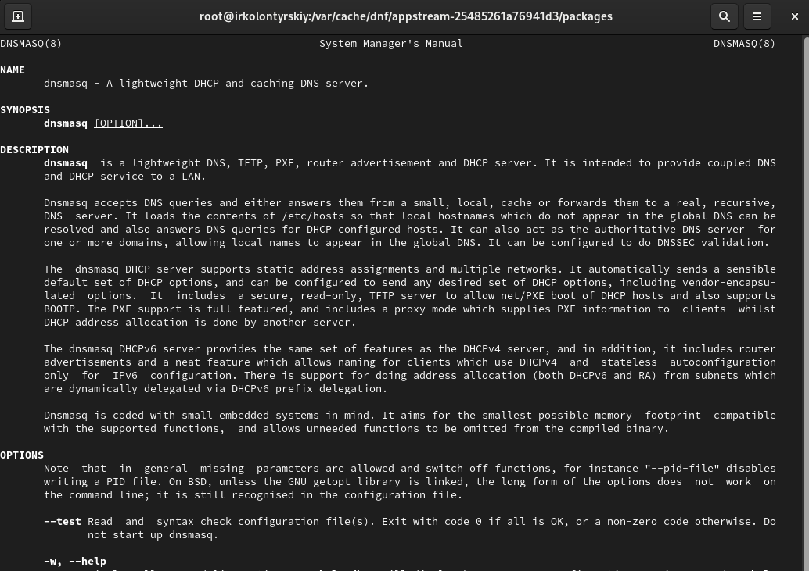{#fig:019 width=70%}

Выведем на экран перечень и месторасположение конфигурационных файлов пакета, выведем на экран расположение и содержание скриптов, выполняемых при установке пакета (рис. [-@fig:020])

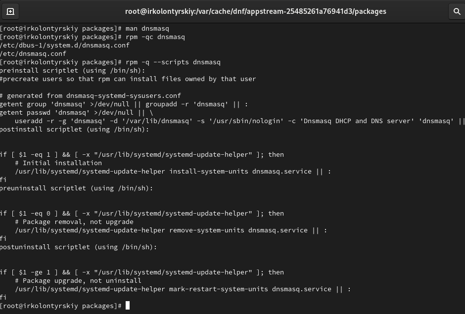{#fig:020 width=70%}

Этот скрипт предназначен для управления установкой, удалением и обновлением пакета dnsmasq.

1. **preinstall scriptlet** выполняется перед установкой пакета. Это необходимо для того, чтобы файлы, устанавливаемые пакетом, могли принадлежать этому пользователю.

2. **postinstall scriptlet** выполняется после установки пакета. Это нужно для того, чтобы служба могла управляться через systemd.

3. **preuninstall scriptlet** выполняется перед удалением пакета. Это необходимо, чтобы корректно удалить все связанные с пакетом настройки.

4. **postuninstall scriptlet** выполняется после удаления пакета. Это нужно для того, чтобы изменения вступили в силу после обновления.

# Контрольные вопросы

1. **Какая команда позволяет вам искать пакет rpm, содержащий файл useradd?**

**rpm -qf $(which useradd)**

2. **Какие команды вам нужно использовать, чтобы показать имя группы dnf, которая содержит инструменты безопасности и показывает, что находится в этой группе?**

**dnf group list**
**dnf group info "Имя группы"**
 
3. **Какая команда позволяет вам установить rpm, который вы загрузили из Интернета и который не находится в репозиториях?**

**rpm -ivh имя_пакета.rpm**

4. **Вы хотите убедиться, что пакет rpm, который вы загрузили, не содержит никакого опасного кода сценария. Какая команда позволяет это сделать?**

**rpm -K имя_пакета.rpm**

5. **Какая команда показывает всю документацию в rpm?**

**rpm -qd имя_пакета**

6. **Какая команда показывает, какому пакету rpm принадлежит файл?**

**rpm -qf /путь/к/файлу**

# Вывод

В ходе выполнения лабораторной работы я получил навыки работы с репозиториями и менеджерами пакетов.

# Список литературы{.unnumbered}

[Туис, курс Администрирование операционных систем](https://esystem.rudn.ru/course/view.php?id=5946)
